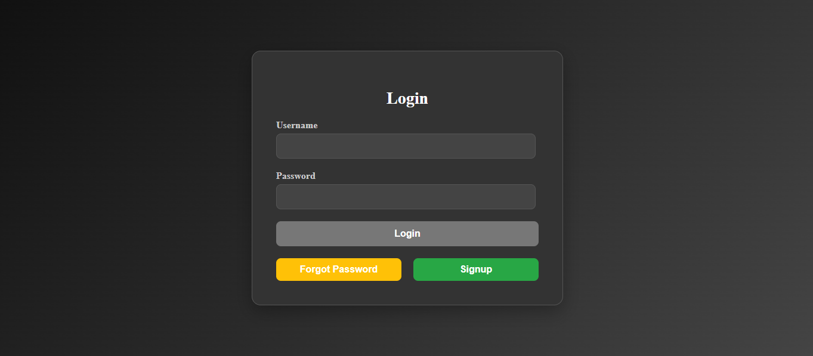
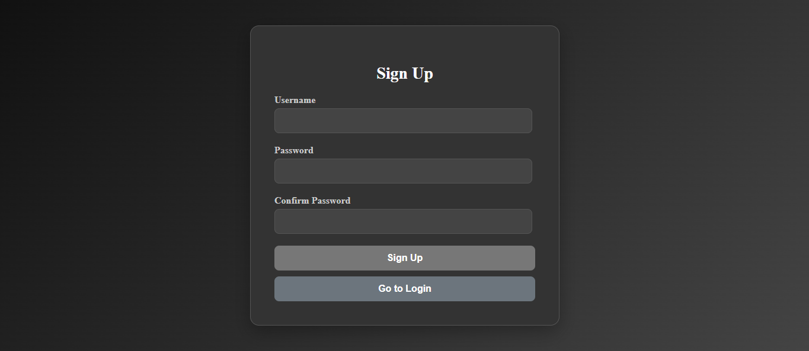
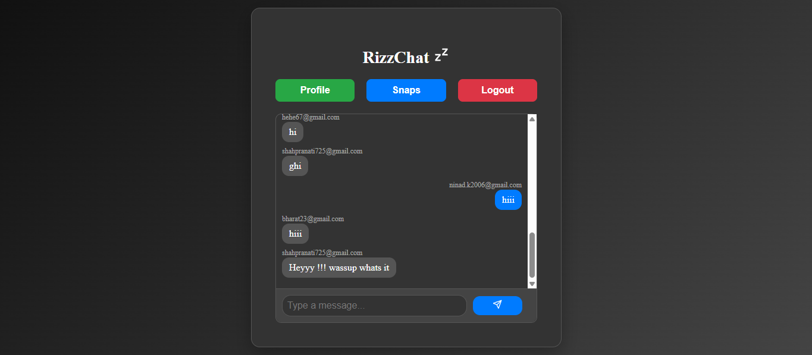
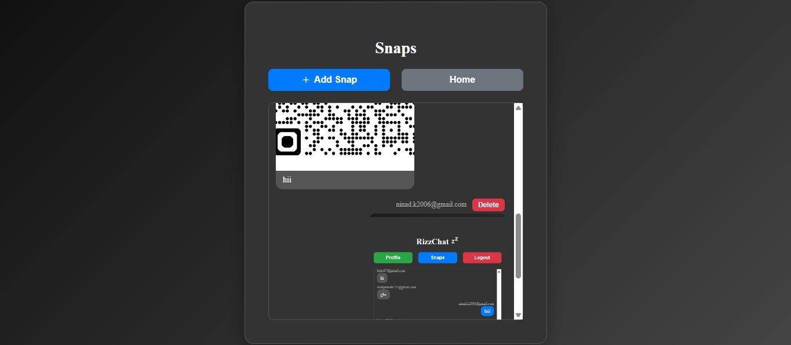
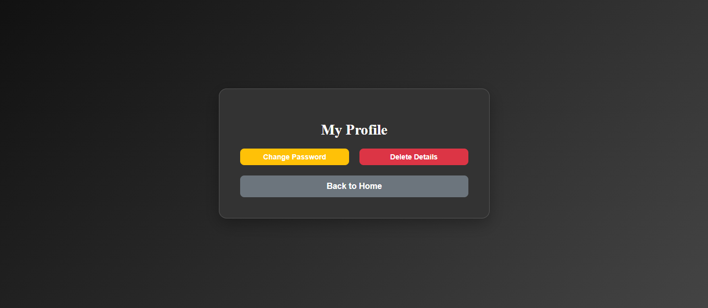
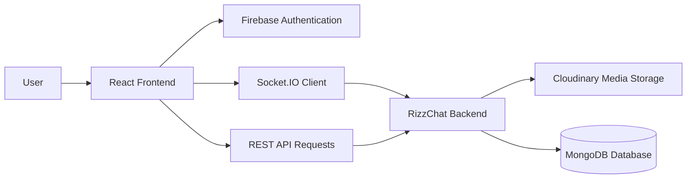

# 💬 RizzChat - Real Time Chat Application

A full-stack real-time chat application with authentication, instant messaging, and media sharing features.

The frontend provides an interactive user experience using React while communicating with the backend through REST APIs and Socket.IO.

---

## 🔗 Links

🌐 Live Demo:  
https://rizzchat-1304.web.app/

⚙️ Backend Repository:  
https://github.com/N1n4d0413/RizzChat-BE

💻 Frontend Repository:  
https://github.com/N1n4d0413/RizzChat-FE

---

## 📸 Preview

### Login


### Signup


### Real-Time Chat


### Snaps / Media Sharing


### Account Management


---

## ✨ Features

- User registration and login
- Authentication using Firebase Authentication
- Password reset functionality
- Account deletion support
- Real-time messaging using Socket.IO
- Media sharing through Snaps
- Responsive user interface

---

## 🏗 Application Flow



---

## 🛠 Tech Stack

### Frontend

- React.js
- Vite
- JavaScript
- CSS

### Libraries
- Socket.IO Client

### Services

- Firebase Hosting
- Firebase Authentication

---

## ⚙️ Installation & Setup

Clone the repository:

```bash
git clone https://github.com/N1n4d0413/RizzChat-FE.git

cd RizzChat-FE
```

Install dependencies:

```bash
npm install
```

Start development server:

```bash
npm run dev
```

---

## 📌 Future Improvements

- Message delivery indicators
- User profile customization
- Push notifications
- Improved chat UI

---

## 👨‍💻 Developer

Developed by [**Ninad Kathe**](https://github.com/N1n4d0413)
